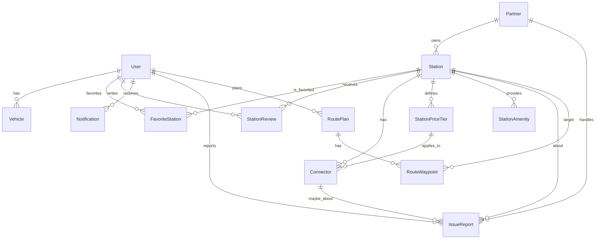

# Banco de Dados — Visão Geral (Prisma + PostgreSQL)

Este documento resume o **modelo de dados** do projeto. O ORM utilizado é **Prisma** e o banco é **PostgreSQL**.

## Stack & Configuração

- **ORM:** Prisma (`generator client = prisma-client-js`)
- **Banco:** PostgreSQL (`datasource db`)
- **Conexão:** variável de ambiente `DATABASE_URL`
- **Moeda padrão:** `BRL` em preços de estação

---

## Entidades Principais

| Domínio          | Tabelas                                                      | Descrição rápida                                                                             |
| ---------------- | ------------------------------------------------------------ | -------------------------------------------------------------------------------------------- |
| **Usuários**     | `User`, `Vehicle`                                            | Usuário final, com veículos (tipo de plug, apelido).                                         |
| **Estações**     | `Station`, `Connector`, `StationPriceTier`, `StationAmenity` | Estações de recarga, seus conectores, tarifas (por kWh/minuto/taxa de sessão) e comodidades. |
| **Descoberta**   | `FavoriteStation`, `StationReview`                           | Favoritos e reviews com rating 1..5 e fotos.                                                 |
| **Notificações** | `Notification`                                               | Notificações por tipo (booking, loyalty, etc.).                                              |
| **Problemas**    | `IssueReport`                                                | Relatos de indisponibilidade/defeitos por usuário ou operador.                               |
| **Parceiros**    | `Partner`                                                    | Donos/operadores das estações (opcionalmente vinculados a um `User`).                        |
| **Rotas**        | `RoutePlan`, `RouteWaypoint`                                 | Planejamento de rotas multi-pontos, waypoints referenciando estações.                        |

---

## Relacionamentos (cardinalidade e deleção)

- `User 1—* Vehicle` (cascade)
- `User 1—* FavoriteStation` e `Station 1—* FavoriteStation` (unique por `[userId, stationId]`; cascade)
- `User 1—* StationReview` e `Station 1—* StationReview` (cascade)
- `User 1—* Notification` (index em `(userId, createdAt)`)
- `Station 1—* Connector` (cascade)
- `Station 1—* StationPriceTier` (cascade) e `StationPriceTier 1—* Connector` (via `priceTierId`, **SetNull** ao remover tier)
- `Station 1—* StationAmenity` (unique por `[stationId, key]`; cascade)
- `Partner 1—* Station` (em `Station.ownerId`, **SetNull** ao remover parceiro)
- `IssueReport` → `reporter: User` (cascade), `owner: Partner?` (cascade), `station: Station` (cascade), `connector: Connector?` (cascade)
- `User 1—* RoutePlan` (cascade), `RoutePlan 1—* RouteWaypoint` (cascade), `RouteWaypoint` → `Station`

**Soft delete:**

- `Station.deletedAt` e `Partner.deletedAt` permitem “desativar” sem apagar dados. Regra de negócio deve filtrar `deletedAt IS NULL` + `isActive`.

---

## Enums (tipos controlados)

- **UserRole:** `user | partner | admin`
- **PlugType:** `CCS2 | Type2 | CHAdeMO | GB_T | Tesla`
- **ConnectorStatus:** `available | occupied | offline | maintenance`
- **BookingStatus:** `pending | confirmed | canceled | expired | completed | no_show` _(reservas futuras)_
- **ChargeSessionStatus:** `started | finished | canceled | failed` _(sessões futuras)_
- **NotificationType:** `booking_created | booking_reminder | booking_canceled | station_issue_update | loyalty_reward | general`
- **IssueType:** `station_offline | connector_broken | price_mismatch | blocked_access | other`
- **IssueStatus:** `open | in_progress | resolved | dismissed`
- **PartnerType:** `charging_operator | retail | hospitality | automotive | other`
- **LoyaltyEventType / RewardType** _(para fidelidade futura)_
- **AmenityType:** `restroom | wifi | parking | food_drink | shopping | lounge | pet_friendly`

---

## Índices & Unicidades Importantes

- `User.email` **único**
- `FavoriteStation` **único** por `[userId, stationId]`
- `StationAmenity` **único** por `[stationId, key]`
- Índices comuns:
  `Vehicle.userId`, `Connector.stationId`, `Connector.priceTierId`,
  `StationPriceTier.stationId`, `StationPriceTier(dayOfWeek, startHour, endHour)`,
  `StationReview.stationId`, `StationReview.userId`,
  `Notification(userId, createdAt)`,
  `IssueReport.stationId | reporterId | ownerId`,
  `RouteWaypoint(routeId, seq)`

---

## Tarifas & Janela de Preço

`StationPriceTier` permite tarifação por:

- `pricePerKWh`, `pricePerMinute`, `sessionFee` (qualquer combinação)
- **Janela opcional**: `dayOfWeek` (0–6), `startHour`, `endHour`
- `isDynamic` para sinalizar precificação dinâmica

Conectores podem apontar para um `priceTier` específico (ou herdar lógica da estação no serviço).

---

## Diagrama (Mermaid)



---

## Regras de Negócio (resumo)

- **Ativação de estação:** `Station.isActive` + `deletedAt` controlam visibilidade.
- **Avaliações:** `ratingAvg`/`ratingCount` mantêm agregados; recalcular ao inserir/editar review.
- **Issues:** workflow via `IssueStatus`; responsável opcional (`ownerId`).
- **Favoritos:** chave única impede duplicidade.

---

## Operacional (Prisma)

```bash
# gerar client após alterar schema
pnpm prisma generate

# criar e aplicar migrações em dev
pnpm prisma migrate dev --name init

# abrir Prisma Studio
pnpm prisma studio
```

**Sempre que alterar o schema do Prisma, lembre-se de atualizar o ER Diagram:**  
https://prisma-erd.simonknott.de/

**Variáveis:** configure `DATABASE_URL` no `.env`.

---

## Roadmap (campos já previstos)

- **Bookings / ChargeSessions / Loyalty**: enums e relacionamentos já preparados para evolução futura sem breaking changes.

---

> **Resumo:** o modelo foca em **experiência do usuário** (favoritos, reviews, notificações), **operação de estações** (conectores, tarifas, comodidades), **qualidade de serviço** (issues) e **planejamento de rotas** — com deleções cuidadosas (soft delete/SetNull) para preservar histórico.
